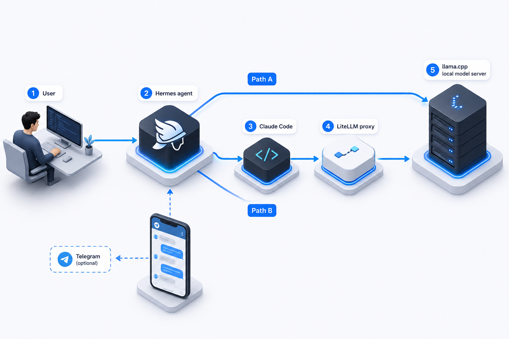
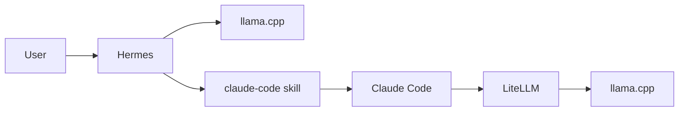
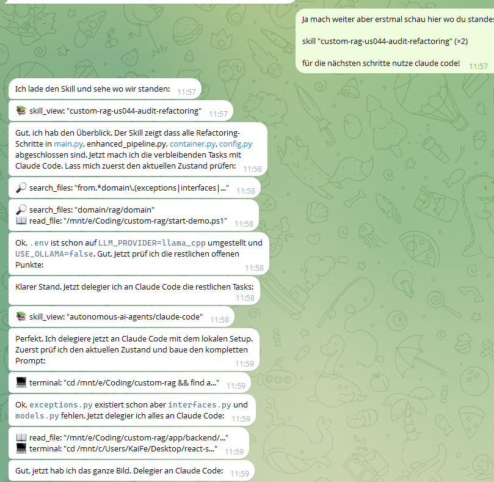
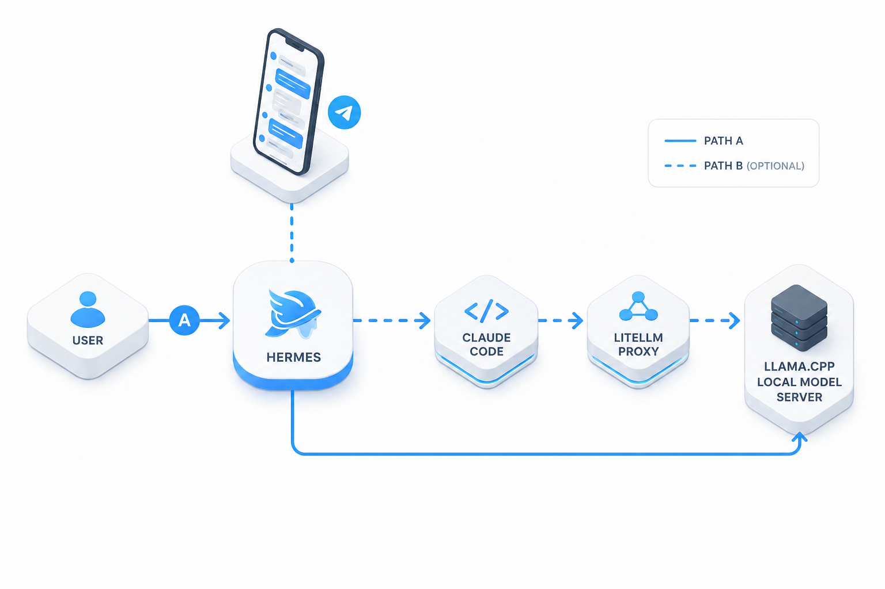
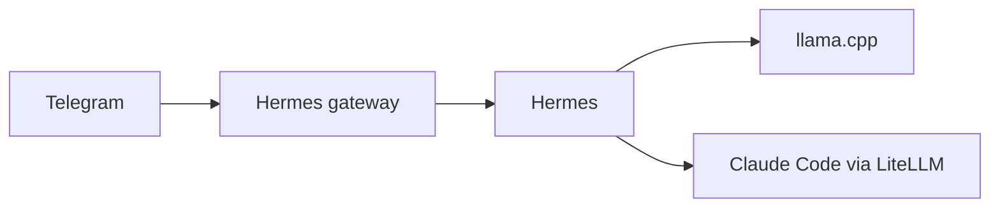

# Hermes Local Stack — Local Agentic Coding with Claude Code, llama.cpp, Zero API Costs

[](https://github.com/KaiFelixBennett/hermes-claude-code-local/stargazers)
[](LICENSE)
[]()
[](https://hermes-agent.nousresearch.com/)
[](https://github.com/ggerganov/llama.cpp)

> **A 4-hour autonomous coding session — 7,256,671 tokens — would have cost $94.34 on Claude Opus 4.7. With this stack: $0.**

This repo wires [Hermes Agent](https://hermes-agent.nousresearch.com/) directly to `llama.cpp` and optionally bridges Claude Code through a local LiteLLM proxy — so your agent calls tools, edits files, and runs task loops 100% on your own hardware.

---

<p align="center">
  <strong>Real session &nbsp;·&nbsp; 4 hours &nbsp;·&nbsp; 7,256,671 tokens</strong><br/>
  <sub>Same session with Claude Opus 4.7 would have cost <strong>~$94.34</strong> &nbsp;·&nbsp; Cost with this stack: <strong>less than a coffee</strong></sub>
</p>

<p align="center">
  
</p>
<p align="center">
  
</p>

<p align="center"><em>Session title: "Claude Code Migration im Hintergrund läuft #7" — Hermes autonomously ran a multi-step code migration in the background, 7th iteration, while the phone stayed in my pocket.</em></p>

---

## Quick Start

### Windows (PowerShell)

```powershell
./setup_hermes_local.ps1
```

### Linux / macOS

```bash
curl -fsSL https://raw.githubusercontent.com/KaiFelixBennett/hermes-claude-code-local/main/setup.sh | bash
```

**That's it.** The setup script verifies your environment, configures Hermes with llama.cpp, and launches everything in one command.

---

<p align="center">
  
</p>

## What You Get

- **Agentic coding, fully local** — Hermes plans multi-step tasks, calls tools (web search, file edits, browser), and executes autonomously without cloud round-trips
- **Hermes Agent** running locally with llama.cpp as the inference engine
- **Claude Code bridge** via LiteLLM (optional) — Claude Code talks to your local model instead of Anthropic's API
- **Telegram integration** — control Hermes from any device via Telegram, including voice messages
- **Zero API costs** — everything runs on your hardware
- **MTP / speculative decoding** — faster inference with Qwen3.6-27B-MTP GGUF out of the box
- **Self-healing scripts** — LiteLLM restarts automatically if it crashes
- **Model tuning notes** per GGUF under `docs/models/`

---

## Architecture

The core path looks like this:

`Hermes -> llama.cpp`

and for local Claude Code tasks:

`Hermes -> claude-code skill -> Claude Code -> LiteLLM -> llama.cpp`



### Why This Hybrid Setup?

At first glance, the architecture looks more complicated than just pointing everything straight at one local model. In practice, the split is what makes the system stable:

- **Hermes** talks directly to `llama.cpp` — fewer moving parts, lower overhead, simpler debugging
- **Claude Code** goes through LiteLLM — it expects Anthropic-style API behavior and is pickier about compatibility
- The wrapper scripts auto-heal the bridge when LiteLLM is not already running

**The honest trade-off on Claude Code:** Claude Code is a powerful tool but has a real runtime overhead — system prompt, tool schemas, and scaffolding can consume 60k+ tokens before your first message on a 64k context window. With Hermes talking directly to llama.cpp, that overhead disappears. Claude Code becomes worthwhile again once you run 128k+ context reliably; until then, Hermes direct is the better default for agent loops.

### Why llama.cpp and not Ollama?

Ollama has a friendlier setup experience, but llama.cpp was chosen here for three reasons:
1. **MTP / speculative decoding** support for the Qwen3.6-27B-MTP GGUF (measurable speed boost)
2. **Fine-grained control** over GPU backends (HIP, Vulkan, CUDA) and context windows
3. **Direct API compatibility** — llama.cpp speaks the OpenAI `/v1` format natively without an extra translation layer

If you prefer Ollama, the LiteLLM bridge in this stack can route to an Ollama endpoint with a one-line config change.

### Why Dense over MoE for Agentic Tasks?

MoE models (e.g. Qwen 35B-A3B) activate only a fraction of parameters per token — great for throughput, but they can drift on long agent loops where consistent multi-step reasoning matters. A dense 27B model activates all parameters on every step:

- **More stable over long task chains** — fewer reasoning errors when Hermes is 5–10 tool calls deep
- **Less hallucination on sequential code edits** — the model holds intent across the full loop
- **Verified in practice** — the 4-hour session was iteration #7 of an autonomous code migration, 9+ user turns, running unattended via Telegram

The trade-off: MoE models can handle larger context windows faster on the same hardware. Once you can run 128k+ context reliably on your setup, re-evaluating a larger MoE makes sense.

---

## Who This Is For

Use this repo if you want one of these outcomes:

- run autonomous agentic coding tasks locally with zero API costs
- control Hermes from Telegram while it works in the background
- test Claude Code against a local model instead of the Anthropic API
- keep working launch scripts and config in one place
- reuse the setup later on another machine with minimal changes

---

## Prerequisites

| Requirement | Minimum | Recommended |
|-------------|---------|-------------|
| OS | Windows 10/11 (WSL2) or Linux/macOS | Windows 11 + WSL2 Ubuntu |
| RAM | 16 GB | 32 GB |
| Disk | ~10 GB for model + tools | SSD |
| GPU | **Strongly recommended** | AMD Radeon (ROCm/HIP) or NVIDIA (CUDA) |

> **On GPU:** For the Qwen3.6-27B Q4_K_M model used here, plan for **24+ GB VRAM** — the model weights alone are ~14.5 GB, and the KV cache at 64k context adds several GB on top. 16 GB VRAM will be tight or require CPU offload (noticeably slower). CPU-only works but is very slow for interactive agent loops; consider a 7B Q4 model if GPU is not available.

You should already have:

- Hermes installed in WSL (Windows) or natively (Linux/macOS)
- `claude` CLI installed (for the Claude Code bridge path)
- a local GGUF model available on disk
- a working `llama.cpp` binary (or let `setup.sh` install it)

This repo gives you the wiring, launch scripts, and tested configuration. It does not ship model weights or llama.cpp binaries.

---

## Setup

### Option A: One-Command Setup (Recommended)

**Windows:**
```powershell
./setup_hermes_local.ps1
```

**Linux / macOS:**
```bash
bash setup.sh
```

What these scripts do:

1. Verify required local files exist
2. Check your configured GGUF path in `hermes_config.yaml`
3. Prompt for a GGUF path if the configured one is missing
4. Write the new path back to `model.path`
5. Start the normal Hermes launcher

With Claude Code bridge:

```powershell
# Windows
./setup_hermes_local.ps1 -WithClaudeBridge

# Linux / macOS
bash setup.sh --with-claude-bridge
```

Config-only (no launch):

```powershell
# Windows
./setup_hermes_local.ps1 -SkipLaunch

# Linux / macOS
bash setup.sh --skip-launch
```

### Option B: Manual Start

**Hermes only:**
```powershell
# Windows
./start_hermes.bat

# Linux / macOS
bash start_hermes.sh
```

**Hermes + Claude Code bridge:**
```powershell
# Windows
./start_hermes_claude_local.bat
```

This path checks or starts `llama.cpp`, starts LiteLLM on `127.0.0.1:4000`, launches Hermes, and ensures Claude Code subprocesses use the local gateway.

**Claude Code check without Hermes:**
```bash
./claude_local.sh -p 'Reply with exactly OK.' --output-format json
```

The wrapper auto-starts LiteLLM on demand. Verify success when JSON output contains `modelUsage.qwen-local-anthropic`.

---

## What This Looks Like In Practice

Hermes inspects the current state, switches into the `claude-code` skill when deeper coding work is needed, and delegates through the local Claude Code bridge:

<p align="center">
  
</p>

---

## Telegram Integration

Hermes is not tied to one terminal window — you can control it from Telegram:

- Run Hermes on your local machine or in WSL
- Keep the model and tooling running in the background
- Message Hermes from Telegram instead of sitting in front of the terminal
- Hermes uses the same local stack while you interact from chat

<p align="center">
	
</p>



### Connect Your Own Telegram Bot

The shortest stable setup flow:

1. Create a bot with [@BotFather](https://t.me/BotFather)
2. Get your numeric Telegram user ID
3. Run `hermes gateway setup` in WSL and choose Telegram
4. Start the gateway with `hermes gateway`
5. Send your bot a message and verify Hermes replies

Official references:

- [Hermes Messaging Gateway Overview](https://hermes-agent.nousresearch.com/docs/user-guide/messaging/)
- [Hermes Telegram Setup](https://hermes-agent.nousresearch.com/docs/user-guide/messaging/telegram)
- [Hermes Security Guide](https://hermes-agent.nousresearch.com/docs/user-guide/security)

> **Note:** Telegram group privacy mode is the most common reason bots appear "silent" in groups. If you change privacy mode in BotFather, remove and re-add the bot to the group afterwards.

---

## Configuration

The main config file is `hermes_config.yaml`. The only values you typically need to change:

| Field | What It Does | Example |
|-------|-------------|---------|
| `model.path` | Path to your GGUF model file | `E:\models\qwen3.6.gguf` |
| `model.backend` | GPU backend for llama.cpp | `hip`, `vulkan`, `cuda`, `cpu` |
| `model.binary_dir` | (optional) Pin a specific llama.cpp build | — |

Everything else — Hermes, LiteLLM, Claude Code — is pre-configured and works out of the box.

### Current Verified Defaults

```text
ANTHROPIC_BASE_URL=http://127.0.0.1:4000
ANTHROPIC_AUTH_TOKEN=***
ANTHROPIC_MODEL=qwen-local-anthropic
ANTHROPIC_CUSTOM_MODEL_OPTION=qwen-local-anthropic
```

Model tuning details are documented in `docs/models/qwen3.6-27b-mtp-gguf-llamacpp.md`.

---

## Files That Matter

| File | Purpose |
|------|---------|
| `hermes_config.yaml` | Main Hermes provider and model config |
| `setup_hermes_local.ps1` | First-run setup wizard (recommended entry point) |
| `start_hermes.bat` | Quick start Hermes + llama.cpp |
| `start_hermes_claude_local.bat` | Start with Claude Code bridge |
| `start_llamacpp.ps1` | Starts llama.cpp from repo config |
| `start_litellm.ps1` | Starts LiteLLM for the Claude bridge |
| `claude_local.sh` | Local Claude Code entry point (standalone) |
| `ensure_claude_local_bridge.sh` | On-demand LiteLLM self-healing wrapper |
| `litellm.proxy.yaml` | LiteLLM bridge config |
| `HERMES_README.md` | Deeper operator notes for this setup |

---

## Reusing on Another Machine

This repo does not ship the GGUF model or llama.cpp binaries. Usually only these parts need to change:

1. `model.path` in `hermes_config.yaml`
2. The installed llama.cpp backend and binary folder
3. Machine-specific paths to GGUFs or tools
4. Optional GPU backend tuning

The launch scripts resolve paths dynamically — you typically don't need to edit them manually.

---

## Troubleshooting

### llama.cpp won't start on Windows

Check that your GPU backend matches your hardware in `hermes_config.yaml`:

- AMD Radeon → set `model.backend: "hip"`
- NVIDIA → set `model.backend: "cuda"` or `"vulkan"`
- No GPU → set `model.backend: "cpu"` (slower but works)

### LiteLLM bridge is down

The wrapper scripts auto-heal. If it's still not working:

```powershell
# Windows
./start_litellm.ps1

# Linux / macOS
make litellm
```

### Hermes can't reach llama.cpp

On Windows with WSL2, make sure mirrored networking is enabled (default in WSL 2.0+). Test from inside WSL:

```bash
curl http://127.0.0.1:8080/v1/models
```

### Telegram bot appears silent in groups

- Check that privacy mode is disabled in BotFather
- Remove and re-add the bot to the group after changing settings
- Hermes can also stay DM-only for the simplest setup

---

## Why This Setup?

Local LLMs are great for privacy and cost control, but Claude Code expects an Anthropic-compatible API. This repo solves that with a hybrid architecture:

- **Hermes** talks directly to llama.cpp (minimal overhead)
- **Claude Code** goes through LiteLLM (Anthropic API compatibility layer)
- Both share the same local model — no duplicate inference servers needed

A real session on an AMD Radeon AI PRO R9700 (32 GB VRAM) ran **7 million tokens for €0** across an evening of agent-driven coding. The architecture described here is exactly what was running.

---

## Contributing

Issues, PRs, and config contributions for different hardware setups (NVIDIA CUDA, Apple Silicon, CPU-only builds) are very welcome.

The most useful contributions right now:
- **Hardware configs** — got it running on NVIDIA / Apple Silicon / CPU-only? Open a [Hardware Config issue](https://github.com/KaiFelixBennett/hermes-claude-code-local/issues/new?template=hardware_config.md) or add a file under `docs/models/`
- **Bug reports** — especially for WSL2 edge cases and GPU backend quirks
- **Script improvements** — portability, error messages, edge cases

If this stack saves you money or solves a problem, a ⭐ on the repo helps others find it.

---

## Community

This project exists because local LLMs are finally good enough to replace cloud APIs for real agentic work. If you've used it, broken it, or improved it — share it with others who might benefit:

- [r/LocalLLaMA](https://www.reddit.com/r/LocalLLaMA/) — the best community for local model setups
- [r/ClaudeAI](https://www.reddit.com/r/ClaudeAI/) — for Claude Code users
- [Hermes Discord](https://hermes-agent.nousresearch.com/docs/) — for Hermes-specific questions

[](https://star-history.com/#KaiFelixBennett/hermes-claude-code-local&Date)

---

## License

MIT
