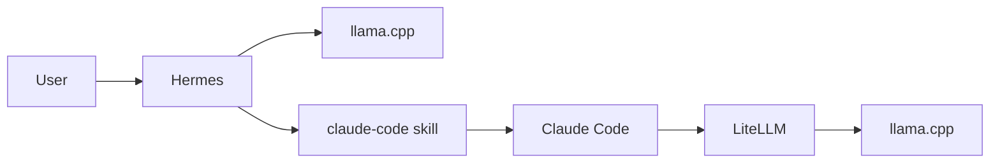
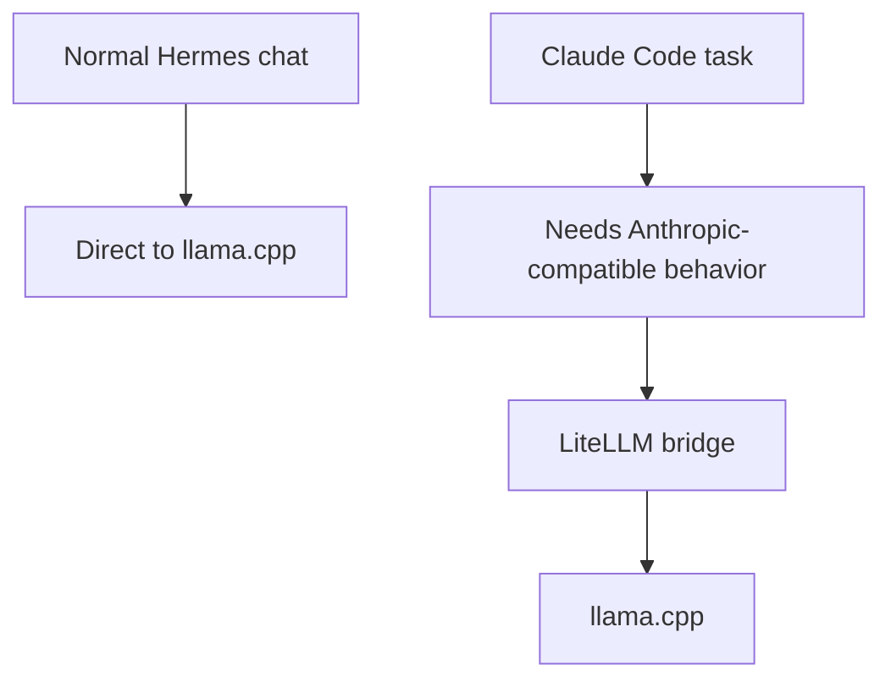
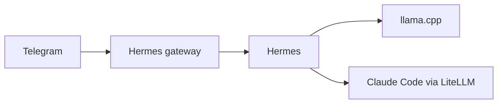

# Hermes Local Stack

This repository is a practical reference setup for running Hermes locally with `llama.cpp`, plus a verified Claude Code bridge through LiteLLM.

The core path looks like this:

`Hermes -> llama.cpp`

and for local Claude Code tasks:

`Hermes -> claude-code skill -> Claude Code -> LiteLLM -> llama.cpp`

<p align="center">
  
</p>

## Prerequisites

Before using this setup, you should already have:

- Windows with PowerShell
- WSL2 with an Ubuntu distro
- Hermes installed in WSL
- `claude` CLI installed in WSL
- a local GGUF model available on disk
- a working `llama.cpp` Windows binary

This repo gives you the wiring, launch scripts, and tested configuration. It does not ship the model weights or the `llama.cpp` binaries themselves.

## What You Get

- Windows launch scripts for `llama.cpp`
- Hermes config for a local OpenAI-compatible provider
- a LiteLLM proxy config that makes Claude Code work against local `llama.cpp`
- wrapper scripts that self-heal the Claude Code bridge when LiteLLM is down
- model-specific tuning notes under `docs/models/`

## Why This Setup Makes Sense

At first glance, the architecture looks more complicated than just pointing everything straight at one local model. In practice, the split is what makes the system understandable and stable.

### Why Hermes talks directly to `llama.cpp`

Hermes itself already works well with a direct local provider.

That gives you:

- fewer moving parts for normal Hermes conversations
- lower overhead for day-to-day local usage
- simpler debugging when the base model path is the thing you want to test
- a clean mental model: Hermes is your main agent, `llama.cpp` is its local brain

### Why Claude Code does **not** go direct here

Claude Code expects Anthropic-style behavior and is much pickier than Hermes about API compatibility.

That is why the local Claude Code path uses LiteLLM in the middle:

- LiteLLM acts as the compatibility layer
- Claude Code gets the API shape it expects
- `llama.cpp` can stay your local inference engine
- the wrapper scripts can auto-heal the bridge when LiteLLM is not already running

So the setup is intentionally hybrid:

- Hermes -> direct `llama.cpp`
- Claude Code -> LiteLLM -> `llama.cpp`

That split is the part that makes the whole system practical instead of fragile.

## Who This Is For

Use this repo if you want one of these outcomes:

- run Hermes locally against `llama.cpp`
- test Claude Code against a local model instead of the Anthropic API
- keep the working launch scripts and config in one place
- reuse the setup later on another machine with only a few machine-specific changes

## Quick Start

### Recommended First Run: One Setup Script

For first-time setup on a new machine, run:

```powershell
./setup_hermes_local.ps1
```

What this script does:

1. verifies required local files exist
2. checks your configured GGUF path in `hermes_config.yaml`
3. prompts for a GGUF path if the configured one is missing
4. writes the new path back to `model.path`
5. starts the normal Hermes launcher

If you want first run plus Claude Code bridge in one step:

```powershell
./setup_hermes_local.ps1 -WithClaudeBridge
```

If you only want to update config without starting Hermes:

```powershell
./setup_hermes_local.ps1 -SkipLaunch
```

### Option 1: Hermes only

```powershell
./start_hermes.bat
```

Use this when Hermes should talk directly to `llama.cpp` and you do not need Claude Code in the same run.

### Option 2: Hermes plus local Claude Code bridge

```powershell
./start_hermes_claude_local.bat
```

This path:

1. checks or starts `llama.cpp`
2. checks or starts LiteLLM on `127.0.0.1:4000`
3. starts Hermes
4. ensures Claude Code subprocesses use the local LiteLLM gateway

You can also route the regular starter into that mode for the current PowerShell session:

```powershell
$env:HERMES_USE_CLAUDE_LITELLM = "1"
./start_hermes.bat
```

### Option 3: Local Claude Code check without Hermes

```bash
cd /mnt/<your-drive-letter>/<path-to-this-repo>
./claude_local.sh -p 'Reply with exactly OK.' --output-format json
```

That wrapper first runs `./ensure_claude_local_bridge.sh`, which starts LiteLLM on demand if the bridge is not already up.

If you intentionally want the smaller `--bare` prompt surface for experiments, run the same wrapper with `CLAUDE_LOCAL_SIMPLE=1`.

Treat the run as locally verified only when the JSON output contains `modelUsage.qwen-local-anthropic`.

## What This Looks Like In Practice

This is the practical user flow the setup is built for: Hermes inspects the current state, switches into the `claude-code` skill when deeper coding work is needed, and then delegates the coding task through the local Claude Code bridge.

<p align="center">
  
</p>

## Architecture



Read it like this:

- normal Hermes chat goes straight to `llama.cpp`
- Claude Code tasks go through the `claude-code` skill
- local Claude Code runs are bridged through LiteLLM
- LiteLLM is the compatibility layer that makes Claude Code work reliably with the local model setup

## Why Not One Single Path For Everything?



The important idea is simple:

- Hermes is already happy with a direct local model endpoint
- Claude Code is the part that benefits from the extra compatibility layer
- using LiteLLM only where it is needed keeps the setup easier to reason about

## Telegram And Remote Use

One reason Hermes is worth using here instead of treating everything as a local CLI trick is that Hermes is not tied to one terminal window.

Hermes supports messaging gateways, and Telegram is one of the practical ones to keep in mind.

That means you can:

- run Hermes on your local machine or in WSL
- keep the model and tooling running in the background
- message Hermes from Telegram instead of sitting in front of the terminal all the time
- let Hermes use the same local stack and tools while you interact from chat

In other words, the value is not just "local model + scripts". The value is that Hermes can become the long-running agent interface, while Telegram can become the easy control surface.

<p align="center">
	
</p>



If you later want to share this setup with other people, that is a strong story:

- local model for cost control and privacy
- Hermes for durable agent behavior and tools
- Telegram for convenient remote access
- Claude Code as an optional specialist coding path when needed

## Optional: Connect Your Own Telegram Bot

If you want to control Hermes from Telegram, keep the local model setup exactly as it is and add Telegram only as the chat surface.

The shortest stable setup flow is:

1. Create a bot with [@BotFather](https://t.me/BotFather) using Telegram's official bot creation flow.
2. Get your numeric Telegram user ID, as described in the official Hermes Telegram guide.
3. Run `hermes gateway setup` in WSL and choose Telegram.
4. Start the gateway with `hermes gateway`.
5. Send your bot a message in Telegram and verify that Hermes replies.

If you prefer the manual path instead of the wizard, the Hermes docs show the minimal environment variables for `TELEGRAM_BOT_TOKEN` and `TELEGRAM_ALLOWED_USERS`.

For the least stale instructions, use these official references:

- Hermes messaging overview: [Hermes Messaging Gateway Overview](https://hermes-agent.nousresearch.com/docs/user-guide/messaging/)
- Hermes Telegram setup: [Hermes Telegram Setup](https://hermes-agent.nousresearch.com/docs/user-guide/messaging/telegram)
- Hermes security notes: [Hermes Security Guide](https://hermes-agent.nousresearch.com/docs/user-guide/security)
- Telegram bot creation: [Telegram BotFather: Creating a New Bot](https://core.telegram.org/bots/features#creating-a-new-bot)
- Telegram getting-started tutorial: [Telegram Bot Tutorial](https://core.telegram.org/bots/tutorial)

Useful things to know before you add the bot to groups:

- Telegram group privacy mode is the most common reason bots appear to be "silent" in groups.
- If you change privacy mode in BotFather, remove and re-add the bot to the group afterwards.
- Hermes can also stay DM-only if you want the safest and simplest setup.

## Current Verified Defaults

The currently verified Claude Code bridge environment is:

```text
ANTHROPIC_BASE_URL=http://127.0.0.1:4000
ANTHROPIC_AUTH_TOKEN=sk-hermes-local
ANTHROPIC_MODEL=qwen-local-anthropic
ANTHROPIC_CUSTOM_MODEL_OPTION=qwen-local-anthropic
```

The current local model profile is documented in:

- `docs/models/qwen3.6-27b-mtp-gguf-llamacpp.md`

That file captures:

- the currently validated context window
- MTP and speculative decoding decisions
- flash-attention usage
- the local sampling profile
- when MTP helped and when reducing retained context mattered more

## Files That Matter

- `hermes_config.yaml`: main Hermes provider and model config
- `setup_hermes_local.ps1`: first-run setup wizard and launcher (recommended)
- `setup_hermes_local.bat`: double-click wrapper for the setup wizard
- `start_llamacpp.ps1`: starts `llama.cpp` from repo config
- `start_litellm.ps1`: starts LiteLLM in WSL for the Claude bridge
- `claude_local.sh`: standard local Claude Code entry point
  - Defaults to the verified local model alias `qwen-local-anthropic`
  - Set `CLAUDE_LOCAL_SIMPLE=1` to re-enable the reduced-context `--bare` mode for controlled experiments
- `ensure_claude_local_bridge.sh`: on-demand LiteLLM self-healing wrapper
- `litellm.proxy.yaml`: LiteLLM bridge config
- `start_hermes_claude_local.bat`: combined Hermes + Claude Code starter
- `HERMES_README.md`: deeper operator notes for this setup

## What You Need To Adapt On Another Machine

This repo does not ship the GGUF model or the local Windows `llama.cpp` binaries.

If you reuse this setup elsewhere, usually only these parts need to change:

1. `model.path` in `hermes_config.yaml`
2. the installed `llama.cpp` backend and binary folder
3. any machine-specific paths to GGUFs or tools
4. optional backend tuning for your GPU

### Exact Fields To Review

For most users, these are the only values that are machine-specific:

1. `hermes_config.yaml` -> `model.path`
2. `hermes_config.yaml` -> `model.backend` (for your hardware, e.g. `hip`, `vulkan`, `cuda`)
3. `hermes_config.yaml` -> optional `model.binary_dir` (if you want to pin a specific llama.cpp build folder)

Usually you do not need to edit script paths manually anymore:

- `start_hermes.bat` and `start_hermes_claude_local.bat` now resolve the repo path dynamically
- `hermes_gateway.sh` and `hermes_launch.sh` load `hermes_config.yaml` relative to their own script location

The overall architecture can stay the same.

## Why LiteLLM Is In The Middle

Hermes itself talks directly to `llama.cpp`.

Claude Code does not use the direct path here. The validated local route is LiteLLM in the middle, because that is the path that reliably matches Claude Code's Anthropic-style API expectations for this setup.

In short:

- Hermes -> direct `llama.cpp`
- Claude Code -> LiteLLM -> `llama.cpp`

## Suggested Next Split

If this README is later shared more broadly, the clean next step would be:

1. keep this file as the fast-start overview
2. move machine-specific deep details into `HERMES_README.md`
3. keep per-model tuning in `docs/models/`

That gives you one short public-facing entry point and separate deep-dive docs for operators and model tuning.
