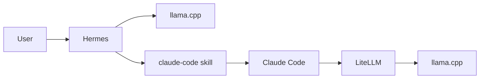

# Hermes Local Stack

This repository is a practical reference setup for running Hermes locally with `llama.cpp`, plus a verified Claude Code bridge through LiteLLM.

The core path looks like this:

`Hermes -> llama.cpp`

and for local Claude Code tasks:

`Hermes -> claude-code skill -> Claude Code -> LiteLLM -> llama.cpp`

## Prerequisites

Before using this setup, you should already have:

- Windows with PowerShell
- WSL2 with an Ubuntu distro
- Hermes installed in WSL
- `claude` CLI installed in WSL
- a local GGUF model available on disk
- a working `llama.cpp` Windows binary

This repo gives you the wiring, launch scripts, and tested configuration. It does not ship the model weights or the `llama.cpp` binaries themselves.

## What You Get

- Windows launch scripts for `llama.cpp`
- Hermes config for a local OpenAI-compatible provider
- a LiteLLM proxy config that makes Claude Code work against local `llama.cpp`
- wrapper scripts that self-heal the Claude Code bridge when LiteLLM is down
- model-specific tuning notes under `docs/models/`

## Who This Is For

Use this repo if you want one of these outcomes:

- run Hermes locally against `llama.cpp`
- test Claude Code against a local model instead of the Anthropic API
- keep the working launch scripts and config in one place
- reuse the setup later on another machine with only a few machine-specific changes

## Quick Start

### Option 1: Hermes only

```powershell
./start_hermes.bat
```

Use this when Hermes should talk directly to `llama.cpp` and you do not need Claude Code in the same run.

### Option 2: Hermes plus local Claude Code bridge

```powershell
./start_hermes_claude_local.bat
```

This path:

1. checks or starts `llama.cpp`
2. checks or starts LiteLLM on `127.0.0.1:4000`
3. starts Hermes
4. ensures Claude Code subprocesses use the local LiteLLM gateway

You can also route the regular starter into that mode for the current PowerShell session:

```powershell
$env:HERMES_USE_CLAUDE_LITELLM = "1"
./start_hermes.bat
```

### Option 3: Local Claude Code check without Hermes

```bash
cd /mnt/c/Users/KaiFe/Desktop/react-sim
./claude_local.sh -p 'Reply with exactly OK.' --output-format json --max-turns 5
```

That wrapper first runs `./ensure_claude_local_bridge.sh`, which starts LiteLLM on demand if the bridge is not already up.

Treat the run as locally verified only when the JSON output contains `modelUsage.qwen-local-anthropic`.

## Architecture



Read it like this:

- normal Hermes chat goes straight to `llama.cpp`
- Claude Code tasks go through the `claude-code` skill
- local Claude Code runs are bridged through LiteLLM
- LiteLLM is the compatibility layer that makes Claude Code work reliably with the local model setup

## Current Verified Defaults

The currently verified Claude Code bridge environment is:

```text
ANTHROPIC_BASE_URL=http://127.0.0.1:4000
ANTHROPIC_AUTH_TOKEN=sk-hermes-local
ANTHROPIC_MODEL=qwen-local-anthropic
ANTHROPIC_CUSTOM_MODEL_OPTION=qwen-local-anthropic
```

The current local model profile is documented in:

- `docs/models/qwen3.6-27b-mtp-gguf-llamacpp.md`

That file captures:

- the currently validated context window
- MTP and speculative decoding decisions
- flash-attention usage
- the local sampling profile
- when MTP helped and when reducing retained context mattered more

## Files That Matter

- `hermes_config.yaml`: main Hermes provider and model config
- `start_llamacpp.ps1`: starts `llama.cpp` from repo config
- `start_litellm.ps1`: starts LiteLLM in WSL for the Claude bridge
- `claude_local.sh`: standard local Claude Code entry point
- `ensure_claude_local_bridge.sh`: on-demand LiteLLM self-healing wrapper
- `litellm.proxy.yaml`: LiteLLM bridge config
- `start_hermes_claude_local.bat`: combined Hermes + Claude Code starter
- `HERMES_README.md`: deeper operator notes for this setup

## What You Need To Adapt On Another Machine

This repo does not ship the GGUF model or the local Windows `llama.cpp` binaries.

If you reuse this setup elsewhere, usually only these parts need to change:

1. `model.path` in `hermes_config.yaml`
2. the installed `llama.cpp` backend and binary folder
3. any machine-specific paths to GGUFs or tools
4. optional backend tuning for your GPU

The overall architecture can stay the same.

## Why LiteLLM Is In The Middle

Hermes itself talks directly to `llama.cpp`.

Claude Code does not use the direct path here. The validated local route is LiteLLM in the middle, because that is the path that reliably matches Claude Code's Anthropic-style API expectations for this setup.

In short:

- Hermes -> direct `llama.cpp`
- Claude Code -> LiteLLM -> `llama.cpp`

## Suggested Next Split

If this README is later shared more broadly, the clean next step would be:

1. keep this file as the fast-start overview
2. move machine-specific deep details into `HERMES_README.md`
3. keep per-model tuning in `docs/models/`

That gives you one short public-facing entry point and separate deep-dive docs for operators and model tuning.
